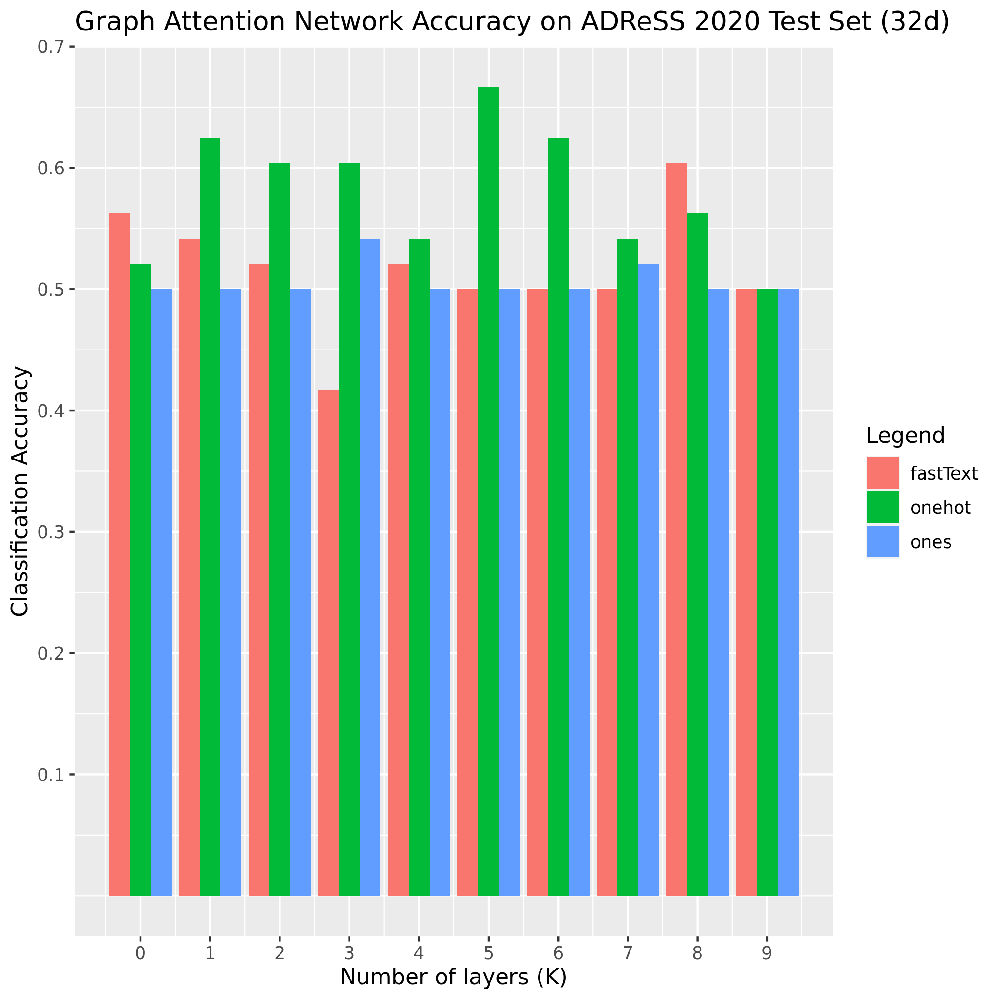

# ADGAT
Classification of Alzheimer's Disease through Graph Attention Learning on Word Co-occurrence Networks

We construct an architecture based off [GATv2Conv](https://github.com/tech-srl/how_attentive_are_gats) developed by _Brody et al. 2022_. We modify the convolutional layers to pay attention to edge weights in our co-occurrence networks.


### 0. Install packages
`conda env create -f environment.yml`

### 1. Download training data
Download from ADReSS 2020 test set from http://www.homepages.ed.ac.uk/sluzfil/ADReSS/ and the DementiaBank from https://dementia.talkbank.org/
Place in data folder:
```
mkdir data
mkdir results
mv DementiaBank data
mv ADReSS-IS2020-data data
```
### 2. Build word vectors
Run `word_vectors.py` on the Dementia Bank transcripts
` python word_vectors.py`

### 3. Train and edit hyperparameters
Use `train_KFold()` in `main.py` to experiment with desired hyperparameters on train/validation splits

### 3. Evaluate Model
Use `train(K, dataset)` and `evaluate()` in `model.py` to test a given model on the ADReSS 2020 test set.



